# Using IFC to Determine Where Healthy Materials Should Be a Prioritiy for Improved IEQ in a Building

## Flooring VOC Emissions and Space Concentrations

### Use case

#### Goal

The goal of the tool is to support the design phase by computing the Volatile Organic Compounds (VOCs) concentration for each space in a building model based on: the off-gassing from the materials in the room, their surface area, and the estimated air change rate of the space. This makes it possible to identify problematic spaces and improvement potentials, since the concentration of VOCs in a room should be limited to ensure a healthy and good indoor air quality.

#### Model use

An Ifc model has to be established with certain data (described further in 'Realized tool') in order for the tool to function. The tool therefore relies on proper modelling from engineers and/or draftsmen and for the model to be established before it can be put into use. The calculations rely on a database of off-gassing values, which have to be obtained for common building products. This requires extensive off-gas testing of materials, which would need to be initiated by the manufacturer and preferably conducted by an official third party. 

The program can be used by anyone working in the built environment who is interested in improving decision making for material selection. More specifically, the tool is likely to be utilized by e.g.: 

- Project managers in the building industry trying to make cost effective decisions while maintaining building health

- Architects focused on designing material and health conscious spaces

- Engineers involved in performing building simulations and other analyses

Disciplinary expertise in indoor air quality (IAQ) and ventilation has been required to develop the tool and is necessary to perform a proper analysis and assessment of VOC concentrations in the spaces based on the information extracted from the IFC. Some background knowledge is also preferred when assessing the output of the tool to determine if adjusted to the buildign design are warranted.
The tool is designed to be used iteratively, with the possibility to swap out materials of the surfaces from the material library. This allows for optimization of the model based on the VOC concentration in the spaces. This could be further paired with e.g. a cost analysis or LCA in order to obtain the most holistic solution. 
The tool can be directly implemented in the project phases 'Author design model', 'Review Design model(s)', and 'Analyze sustainability performance', which are part of the 'Common model uses' described in the BIM execution planning guide. 

### Proposition of tool

##### Ideal tool

The ideal tool that would be constructed if time and ressources were available, would resemble the work-flow sketched in the schematic below: 

This consists of either a *temporal calculation*, done for a given time-series, or a *point-in-time calculation* based on steady state conditions. Both of the calculations require the same background knowledge and input of surface areas for all materials in the room, including from furniture. A check of the file format ensures that the tool is designed to handled the data format, and if so, would be able to retrieve the necessary surface areas, surface materials, and room volume. The space volume is used together with the ventilation rate (which is assumed to be stored in a ventilation model), to calculate the air change rate for each space. Based on supplied off-gassing values for the specific materials or product, it would then be possible to calculate the VOC concentration via one of the two mentioned methods from which the hotspots of the building can be established. The tool should have an option to swap out floor coverings in order to iteratively obtain an optimized solution. The life cycle analysis and costs of the swap should also be accounted for. 

#### Realized tool

Not all aspects of the ideal tool has been possible to implement and therefore a simple, conceptual script has been made to showcase a basic version of the tool. The script mainly focuses on off-gassing calculations from floors on a space-by-space basis.

A schematic of the designed tool is presented in the figure below. The green color indicates actions that contribute to the modification of the Ifc file: 

Firstly, to perform the VOC calculations, surface area of the floor and room volume are needed. The script is therefore constructed to calculate these areas based on the defined geometry for the space. These values are then stored in the quantity set 'Qto_SpaceBaseQuantities', which is constructed by the script in the event the space does not contain this quantitiy set in the original IFC file. 
The script then runs a loop through all unique spaces in the IFC file to retrieve data on each space in a building including: space name, floor area, space volume, and floor covering. The current script calculates only VOC off-gassing from the floor covering, but would (if expanded) be calculated for all walls, floors, ceilings, and furniture in the space. The script, therefore, also runs a loop through all spaces to determine the bounding wall elements and their materials. The information is not yet utilized, but is made available if necessary. 

A list with off-gassing rates for particular flooring materials has been created and is utilized in calculations for VOC concentrations in the spaces.

The emission rate for all flooring in a room is then determined by multiplying the space area and the specific emission rate corresponding to the floor covering in the space. In this particular script, an assumed standard ventilation rate was used along with the extracted space volume to determine the air change rate in the space. Once the space emission rate and air change rate are determined, the VOC concentration in a space can be estimated and is stored in a dataframe and an xlsx file. A plot of the concentration in each space is constructed and a 'Top 10' list is generated to easily compare VOC 'hotspots' in the building. The calculated VOC concentration is stored back into the model via the construction of a new property set called 'VOC_Conc'. Lastly it is possible to swap out the floor coverings via user input, where the user can choose a room based on a list, and swap out the floor covering based on a pre-determined list of floor coverings. At the end, the data that has been modified and stored is written to an updated Ifc file. 

###### IFC Input data:

In order for the script to work, some data has to be defined and stored in the model. The tool is based on the standardized format IFC 4. 
The needed data in order to calculate the total VOC emission of a space is: 

- Rooms = Stored as IfcSpace

- Room identifier = IfcSpace.Name

- Room type = IfcSpace.LongName

- Flooring type = Stored in property set 'Pset_SpaceCoveringRequirements' as 'FloorCovering' linked to the IfcSpace

Some inputs are needed to showcase the possibilities of retrieving the wall area and material, but these inputs are not needed in order to calculate the final VOC calculation. 
These inputs are: 

- Walls = Stored as IfcWall, and related to the spaces as 'BoundedBy'. 

- Wall material = Stored in either IfcMaterial or IfcMaterialConstituentSet which is associated to the IfcWall. 

- Wall area = Stored in quantity set 'Qto_WallBaseQuantities' as 'IfcQuantityArea' named as 'NetSideArea'

###### External input data:

Additional data for the calculations is retrieved concerning the VOC off-gassing values for a self-constructed list of materials. 

- Specific Emission Rate (SER) of materials stored as an xlsx file. 

###### External output data:

The script outputs two files stored in an output folder. They are: 

- Dataframe.xlsx = file containing the VOC concentrations calculated for each space as well as floor covering type, floor area, and room volume. 

- LLYN - ARK_Qto_out.ifc = the final, altered Ifc model with the additional details included by the script. The additions to the input model consists of:
  
  - the property set 'VOC_Conc' which denotes the VOC concentrations of the spaces.
  
  - floor area and room volume are also defined for all rooms in either the already established or newly created quantity set 'Qto_SpaceBaseQuantities'.

  - new floor coverings   

### The value of the tool

The value in this tool is that it provides any constituent in the building design process with an easy tool to perform analysis on the off-gassing of materials in a building based on the building's IFC file. This means that as long as there is in IFC file with spaces and quantities assigned and information on off-gassing for specific materials, a concentration analysis can be conducted in the early design stages to generate improved iterations.
The tool supports the early design stage by providing an overview of the potentially problematic areas in the building by simply importing the Ifc file and running the script. As long as the necessary data is supplied no additional calculations are needed.

DGNB certification already requires testing of TVOC and formaldehyde concentrations in a building. This tool could therefore ensure documentation for DGNB points, or avoid penalties in the future, thereby making it easier to achieve better scores. 

The tool has the societal value of enhancing abiltiy to design and counstruct healthier buildings. This is done by contributing an assessment and improvement oppurtunity for the indoor environmental quality (IEQ) early in the design process. The future building occupants will therefore spend their time in less toxic spaces, avoiding the negative health impacts of VOCs. 
